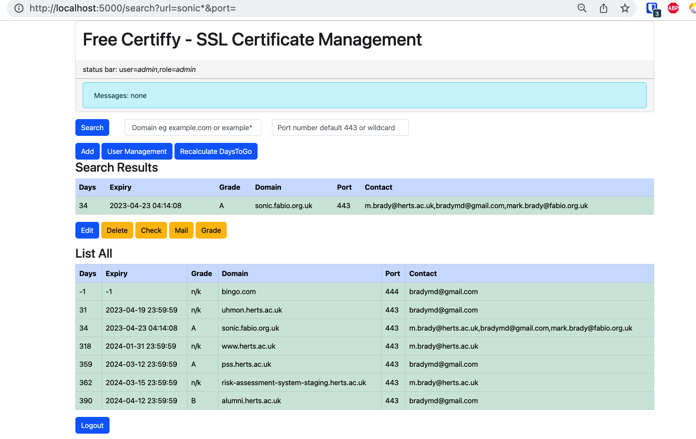

# FreeCertiffy
This project is under development. It is being worked on. It might be more useful for people learning python/flask/blueprints or people looking at useful certificate management code with python. So, lower your expectations all who pass through here.

FreeCertiffy is a free SSL Certificate Manager program. It’s a Flask Python App deployed in a container with a second container – a Mongo Database backend in support (experimenting with redis also). Read more here [https://aardvark.herts.ac.uk/deploying-freecertiffy/](https://aardvark.herts.ac.uk/deploying-freecertiffy/). FreeCertiffy is aimed at those who want to track Certificate expiry dates and has added functionality like users and the ability to send email reminders.



## Running this program
All you need is in the `dist` directory which has the docker-compose-dist.yaml and myenv-dist.env file.
* `docker-compose-dist.yaml`: running freecertiffy in a container
* `myenv-dist.env`: config file, you will need to add your passwords, emails etc
* 
Read [dist/readme-dist.md] as a starting point to run the containers.

Everything else in this repository is if you want access to the flaskapp code or want to work out what it's doing.
Read more about running the flaskapp below and in [freecertiffy/flaskapp/flaskapp/README.md](./flaskapp/flaskapp/README.md)

## docker-compose.yaml here is to build two containers:
  - freecertiffy_flaskapp is the flaskapp container
  - freecertiffy_mongo is the database with volume freecertiffy_mongo

## Fun Facts about the database admin passwords:
  - There has to be an admin user and password to protect the mongo database.
  - These are set in the environment file

## Mongo Database essentials
  - The mongo database is called "freecertiffy" and has two collections: "users" and "certificates"

## Recap, from the top Maestro!
What you need to do to get freecertiffy running successfully...

### Edit __myenv.env__
  - prepare your user "admin" password for the mongo database in the env file

## Run docker-compose with the runonce profile
The runonce profile will do run the initialisation of the mongo user database.
```
    docker-compose --profile runonce up -d
```
This runonce profile is to run certiffy_flaskkapp with an insert program to initialise the user colllection - so you can login.

## Check: List the containers
```
$ docker ps
CONTAINER ID   IMAGE              COMMAND                  CREATED              STATUS          PORTS                      NAMES
cfcf8da62250   mongo              "docker-entrypoint.s…"   About a minute ago   Up 57 seconds   0.0.0.0:27017->27017/tcp   freecertiffy_mongo
4bc53bb04bda   bradymd/flaskapp   "gunicorn -b 0.0.0.0…"   About a minute ago   Up 57 seconds   0.0.0.0:30002->8000/tcp       freecertiffy_flaskapp
```

## Now login
  - login to http://localhost:30002 with the default login is admin/admin.
  - Go into user management and change it.

## Preserving your data
As long as you don't delete the volume the data should be ok even if you destroy the containers. 
From the docker host you can still contact the database with mongosh  and monoexport and mongodump.

## Test it by deleting everything except the volume
```
$ docker-compose stop
$ docker container ls -a --filter name=freecertiffy_mongo -q |xargs docker container rm -f 
$ docker container ls -a --filter name=freecertiffy_redis -q |xargs docker container rm -f 
$ docker container ls -a --filter name=freecertiffy_flaskapp -q |xargs docker container rm -f 
$ docker container ls -a --filter name=freecertiffy_runonce -q |xargs docker container rm -f 
$ docker image  rm bradymd/flaskapp  mongo redis
$ #docker volume rm freecertiffy_mongo
```
Have a look at Makefile for further examples. eg
```
$ make destroy
$ make build
```
## Now for Developing it
### You need the Source Code
```
$ git clone git@github.com:bradymd/freecertiffy.git
```

## Establish python environment
So one time:
```
$ cd flaskapp/flaskapp
$ python3 -m venv ~/.venv/freecertiffy
$ python3 -m pip ~/.venv/freecertiffy/bin/activate
$ pip install -r requirements.txt
```
From now on to activate the env, 
```
$ . ./source_me
```
or
```
$ .   ~/.venv/freecertiffy/bin/activate
```

## Edit your myenv.env
Make sure these are variables are set:
```
ENVIRONMENT="DEVELOPMENT"
FLASK_DEBUG=1
LEVEL=DEBUG
```
Run up the mongo container, stop the flaskapp
```
    docker container  start freecertiffy_mongo
    docker container  stop freedcertiffy_flaskapp
```
Now run flask on the command line:
```
    cd flaskapp/flaskapp
    flask --env-file ../../myenv.env run
```
Thats a way to debug and develop this flaskapp. It restarts if you edit a file.
```
    http://localhost:5000
```
